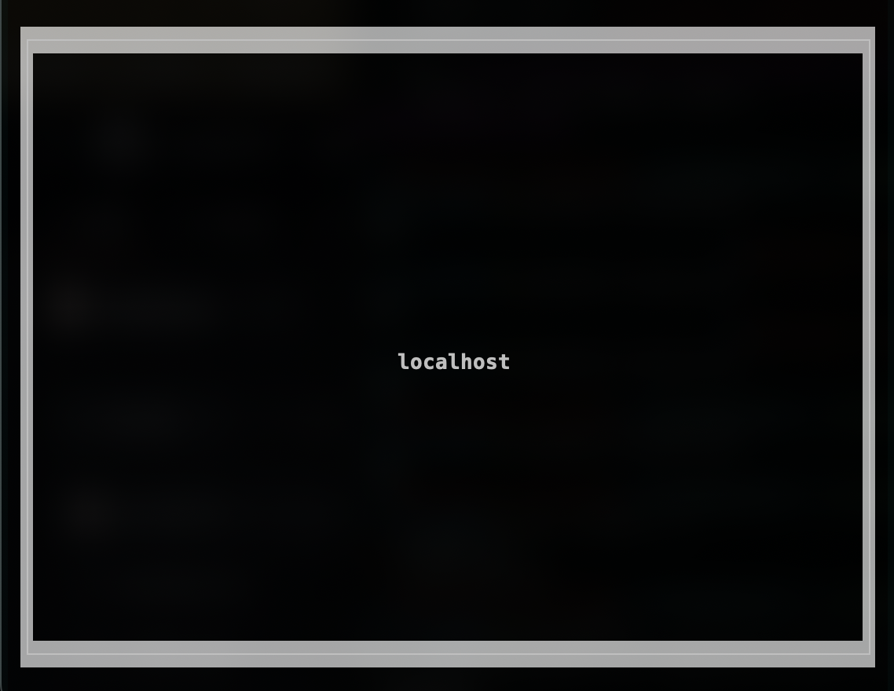
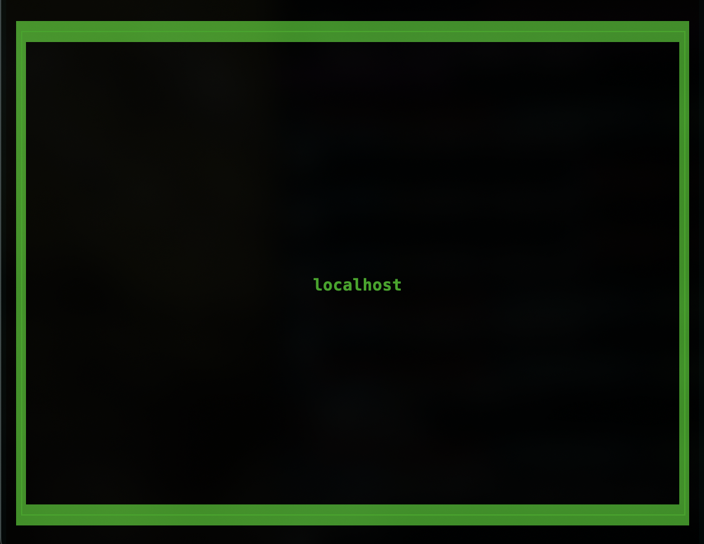
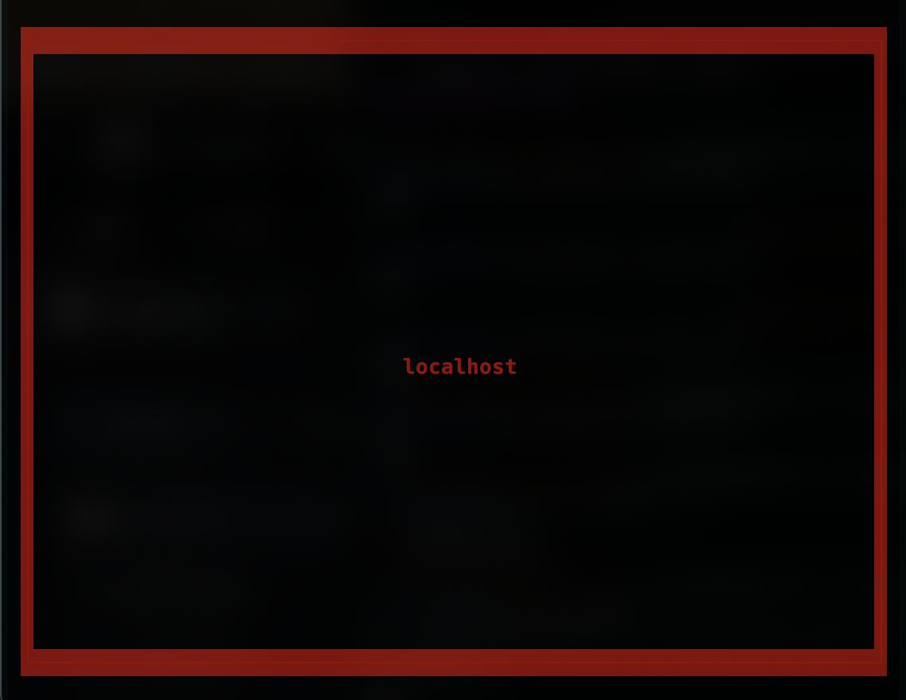

Watcher
=======

Visually monitor browser usage on test machines from a single proctor machine.

Usage
=====

Server-side (test machine)
--------------------------

```
python3 tester.py {port_number} & 
```

Client-side (proctor machine)
-----------------------------

```
python3 classroom.py /path/to/classroom.xml
```

Creating the XML File
=====================

The client machine, or the proctor machine takes an xml file as a command line argument.

Here is an example of an xml file with a single local machine:
```
<classroom id='local'> 
    <continent id='0'>
        <island id='0'>
            <district id='0'> 
                <address id='0' hostname='localhost' port='48999'></address>
            </district> 
        </island>
	</continent>
</classroom> 
```

The xml file serves to logically represent the physical location of the test machines 
in the classroom where the exam takes place. 

Server States 
=============

Disconnected
------------



Idle
----



Violation
---------


